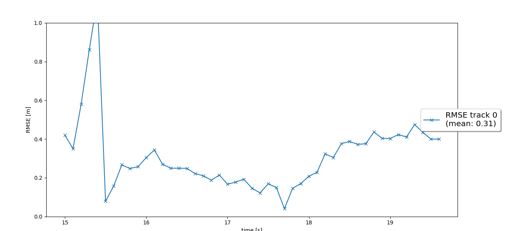
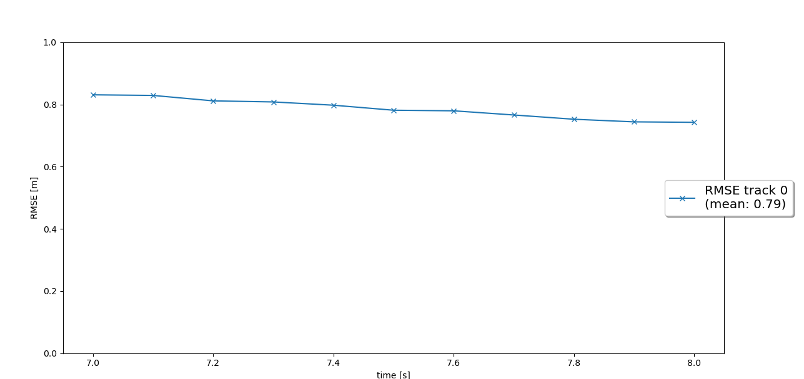
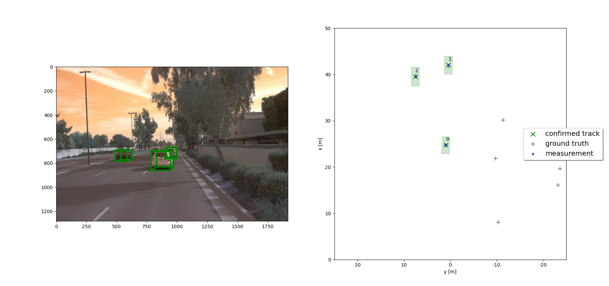
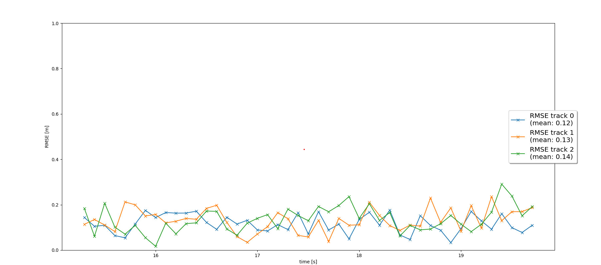

# Writeup: Track 3D-Objects Over Time

### 1. Write a short recap of the four tracking steps and what you implemented there (filter, track management, association, camera fusion). Which results did you achieve? Which part of the project was most difficult for you to complete, and why?

  

`Tracking video is present in workspace/results/my_tracking_results.avi`

### 2. Do you see any benefits in camera-lidar fusion compared to lidar-only tracking (in theory and in your concrete results)? 

- One of the benefits is increased accuracy. The tracking become more accuracte when data from multiple sensors are used. 

- Able to differentiate colors and enable tracking colors since camera is capable of detecting colors.

- By including camera fusion tracking, we can produce a more precise geometric scene understanding and cover a broader range and thus detect more objects.

### 3. Which challenges will a sensor fusion system face in real-life scenarios? Did you see any of these challenges in the project?

- There is need for good noise reduction system, that is produced from system failures and climatic conditions.

- Handling system and sensor failures is a challenge.

- The sensors should work in matching clock state to provide data correctly with respect to time.

### 4. Can you think of ways to improve your tracking results in the future?
